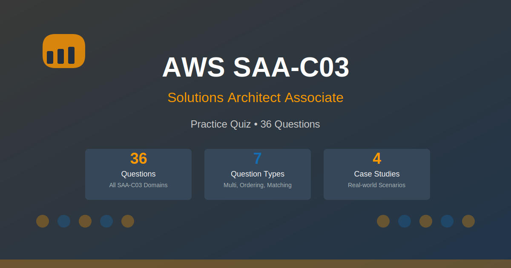

# AWS Solutions Architect Associate (SAA-C03) Practice Questions

[](https://quizplay.io/quiz.html?source=<owner>/<repo-name>)



A comprehensive collection of scenario-based practice questions designed to help you prepare for the AWS Certified Solutions Architect – Associate (SAA-C03) exam. These questions focus on real-world scenarios across multiple domains including security, high availability, disaster recovery, cost optimization, and serverless architectures.

## Content Overview

**Total Questions:** 36 questions + 4 case studies

**Question Types:**
- Single-answer multiple choice
- Multiple-answer questions (select TWO or THREE)
- Scenario-based questions with case study context

**Domain Breakdown:**

### Domain 1: Design Secure Architectures (~35%)
- IAM cross-account access and roles
- S3 security (versioning, MFA Delete, Object Lock)
- AWS WAF and Shield protection
- AWS Secrets Manager with automatic rotation
- CloudTrail, Config, GuardDuty, and Security Hub
- KMS key policies and encryption
- ACM certificate validation
- Cognito User Pools authentication

### Domain 2: Design Resilient Architectures (~30%)
- Multi-region database replication and failover
- CloudFront with S3 origin and origin groups
- Auto Scaling Groups with Elastic Load Balancing
- RDS read replicas and Multi-AZ deployments
- VPC security (NACLs, security groups, VPC peering)
- Backup and disaster recovery strategies
- Route 53 health checks and failover routing
- DynamoDB global tables
- S3 Cross-Region Replication
- Aurora Serverless

### Domain 3: Design High-Performing Architectures (~25%)
- EFS vs FSx file system selection
- ElastiCache Redis cluster mode
- EBS volume types and performance characteristics
- Direct Connect with VPN failover
- AWS Global Accelerator
- Serverless API with Lambda and API Gateway

### Domain 4: Design Cost-Optimized Architectures (~10%)
- S3 lifecycle policies and Intelligent-Tiering
- EC2 Spot Instances with Spot Fleet
- Lambda cost optimization
- S3 storage class optimization
- AWS Trusted Advisor cost checks
- Resource right-sizing strategies

**Case Studies:**
The repository includes 4 detailed case studies representing realistic company scenarios:
- **VoltEdge Media** - Global video streaming platform
- **BrightForge Analytics** - Data analytics SaaS platform
- **HelioPay Financial** - Payment processing service
- **TerraSync Logistics** - Supply chain management platform

## What This Does Not Cover

These practice questions are focused on the SAA-C03 exam domains but do not:
- Cover every single AWS service in exhaustive detail
- Replace hands-on experience with AWS services
- Include operational/support questions (covered in SysOps exam)
- Cover developer-specific topics in depth (covered in Developer exam)
- Substitute for official AWS training courses or documentation

## Important Disclaimer

> [!IMPORTANT]
> These questions are **AI-generated** for study and practice purposes. They are **not** exam dumps and do not contain actual questions from the certification exam. Use them to test your understanding of concepts, not as a substitute for official study materials.

## Usage

This repository is designed to be used with the [Quiz Player](https://quizplay.io). Click the badge above to launch the quiz directly.

You can also:
- Browse the questions locally in the `questions/` directory
- Read the case studies in the `scenarios/` directory
- Use the JSON files with your own quiz application

## Repository Structure

```
├── questions/           # 36 individual question files
├── scenarios/           # 4 case study scenarios
├── assets/
│   └── images/         # Preview images and diagrams
└── quiz.json           # Quiz metadata
```

## Contributing

Found an error or have suggestions for improvement? Feel free to open an issue or submit a pull request.

## License

This project is licensed under the GNU Affero General Public License v3.0 (AGPL-3.0). See the LICENSE file for details.

---

**Study Tips:**
- Review each explanation thoroughly, not just the correct answer
- Understand *why* incorrect options are wrong
- Practice identifying key words in questions (e.g., "most cost-effective", "least operational overhead")
- Review AWS service documentation for topics you find challenging
- Use AWS Free Tier to get hands-on experience

Good luck with your AWS certification journey! 🚀
